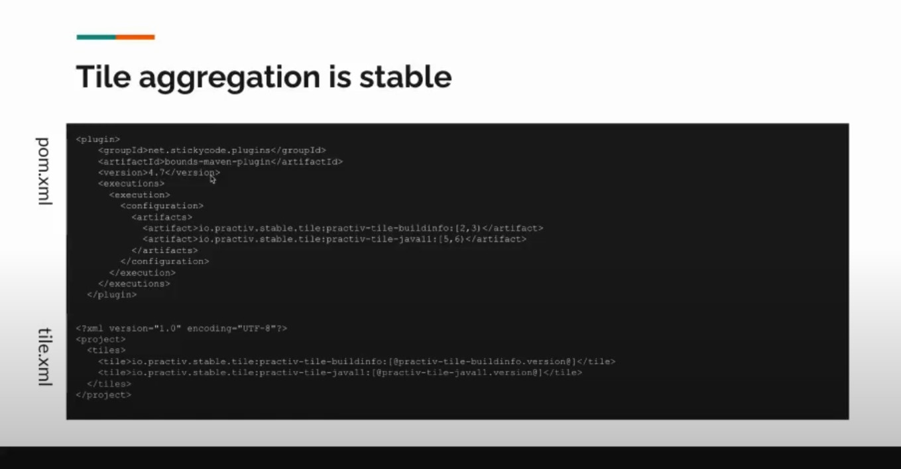

1. 'packaging' with value 'jar' is invalid. Aggregator projects require 'pom' as packaging. @ line 4, column 109
   1. <packaging>pom</packaging>
   2. Parent can't be jar, hence it should be explicitly declared as pom packaging
2. Was cached in the local repository, resolution will not be reattempted until the update interval o
   1. mvn clean -U
   2. <updatePolicy>always</updatePolicy> -- in the settings.xml
3. Non-resolvable parent POM for org.nikias:MavenChild:${revision}: Cannot access central
   1. <version>${revision}</version> inside parent tag didn't work, it should be absolute version
4. [How to echo from maven?](https://stackoverflow.com/questions/3416573/how-can-i-display-a-message-in-maven?answertab=trending#tab-top)
   1. Use maven-antrun-plugin and  <echo>[your message]:${Urkey}</echo>
   2. [Maven echo plugin](http://khmarbaise.github.io/echo-maven-plugin/)
   3. use groovy-maven-plugin and echo - log.info('Test message: {}', 'Hello, World!')
      1. Worked on windows, while antrun plugin few times failed
5. [How to check if a file exists](https://stackoverflow.com/questions/13975887/check-for-life-cycle-phase-and-file-existence-in-maven-and-report-error)
   1. You might also want to use the Enforcer goal instead of antrun: http://maven.apache.org/enforcer/enforcer-rules/requireFilesExist.html
   2. Use antrun-maven plugin
6. [How to build a maven plugin](https://developer.okta.com/blog/2019/09/23/tutorial-build-a-maven-plugin)

## Apache Maven Tiles
1. [Apache Maven Tiles](https://www.youtube.com/watch?v=YUoNCqqg8FY&t=73s)
2. [Mixins with Maven](https://prezi.com/yyp9kacrpep0/mixins-with-maven/)
3. [Maven tiles](https://kandi.openweaver.com/groovy/repaint-io/maven-tiles)
4. Composition for Apache Maven POM's
   1. Rather than managing common list dependencies for multiple projects, rather keep updating in multiple projects
   2. Lots of different services, common dependencies with common version, but also varying slightly between different version
   3. Micronaut heavily used in few places (not related to this topic)
5. Multiple dependencies can be declared as a tile and could be reffered in another project
   1. Wherever we need we can refer with [from, to_version)'
      1. [2.20, 3)
   2. Tile can be independently updated, refer would take latest version
   3. They are bundled as jars
   4. It is no-code project
   5. **You don't have deterministic dependencies, due to the range**
   6. You can use the automated test to fail the build to avoid surprises of *non-determinism*
   7. mvn -u -- would force to re-download latest and re-index, this is very handy when tiles are updated
6. Tiles limitations
   1. Based on virtual parent
   2. Happens after extensions, hence doesn't support extensions
   3. Tiles composition is unstable due to ranges
   4. Few Gotchas
      1. Tile properties may not be available for POM interpolation
      2. Tiles in tiles are always after locally declared - tiles - hard to control order
      3. Using lifecyles carefully is really important
      4. Extension don't work in tiles
      5. Tiles can be opaque if you are not verbose in the log
7. Valid usecases
   1. All the build-plugins can be manged from here
   2. Exclusions will not work
8. Dependencies are not recommended
9. tiles 2.2.0 - has some determinism in inserting major tile, and its nested and its nested.
   1. Worth upgrading
10. Stable Tile
    1. 

## Marc Derricut
1. [Author of Maven tiles](https://search.maven.org/artifact/io.repaint.maven/tiles-maven-plugin)